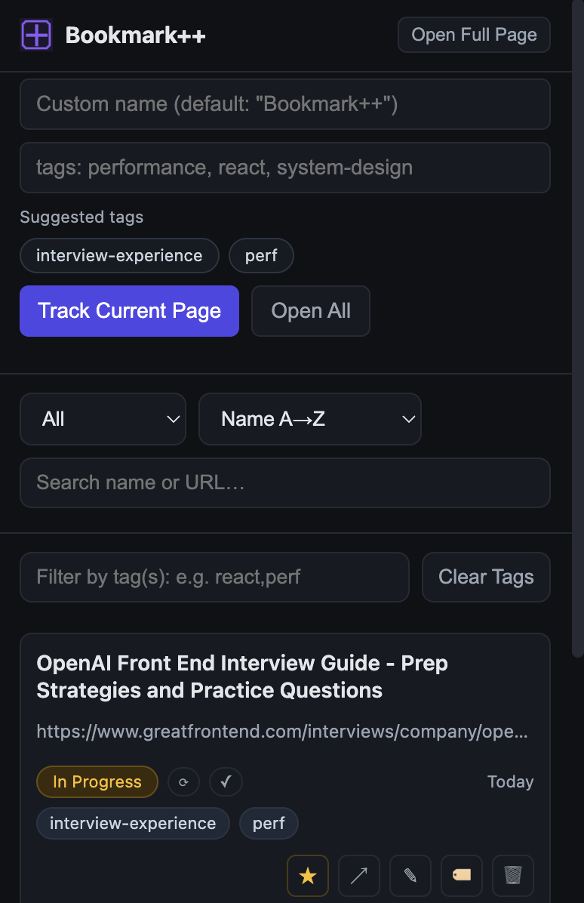

# Prep Page Tracker (Chrome Extension)

A compact, dark-themed Chrome extension to organize your job-prep reading list.
Save the current page with a custom name, **tags**, **star** important items, and track status (**Not Started / In Progress / Done**).
Includes a right-click **Track Page** action and a **full-page** UI option for a larger workspace.



## Features

- **Track any page** via popup or right‑click **Track Page**
- **Custom name** + **Tags** (with **suggested tags** built from your history)
- **Status chips** with inline actions (⟳ cycle, ✓ done)
- **Star** important items
- **Search / Filter by status & tags / Sort**
- **Open All** (non‑done items)
- **Import / Export** your list as JSON
- **Full‑page view** (open the popup UI in a tab for more space)
- **Sync storage** (uses `chrome.storage.sync` within Chrome sync quotas)

## Install (Unpacked)

1. Download the latest zip from releases or this repo folder.
2. Unzip it to a local directory.
3. Visit `chrome://extensions`, enable **Developer mode**.
4. Click **Load unpacked** and select the unzipped folder.
5. (Optional) Pin the extension to your toolbar.

## Usage

- Click the toolbar icon to open the popup.
- Enter a **Custom name** and **Tags** (or click from **Suggested tags**) then hit **Track Current Page**.
- Manage your items:
  - Click **★** to star/unstar.
  - Use the **status chip** and inline buttons to update status.
  - Click **Visit** / ↗ to open the link.
  - **Rename** (✎) or **Edit tags** (🏷).
  - Delete (🗑) — instant, no confirmation by default (configurable in code).
- Use **Open Full Page** to open the UI in a new tab.
- **Export** to back up, **Import** to restore on another device.

## Keyboard & Power Tips

- The popup’s **Open All** opens up to 10 non‑done items at once.
- Use **search** to match both names and URLs.
- **Tag filtering** matches all specified tags (AND logic).

## Data Model

Each tracked item is stored under `chrome.storage.sync` as part of `trackedPages` array:

```json
{
  "id": "uuid",
  "url": "https://…",
  "name": "Custom label",
  "status": "todo | in-progress | done",
  "starred": false,
  "tags": ["react","performance"],
  "createdAt": 1731000000000,
  "updatedAt": 1731000000000
}
```

> Your data stays in your browser profile’s synced storage (subject to Chrome’s sync quotas).

## Permissions

- `storage` — to save your reading list
- `tabs` — to read current tab URL/title and open links
- `contextMenus` — to add the right-click **Track Page** action
- `host_permissions: <all_urls>` — to allow saving any page

## Folder Structure

```
prep-page-tracker/
├─ manifest.json
├─ background.js
├─ popup.html
├─ popup.css
├─ popup.js
├─ icons/
│  ├─ icon16.png
│  ├─ icon32.png
│  ├─ icon48.png
│  └─ icon128.png
└─ images/
   ├─ popup-view.png
```

## Development

- Edit files, then in `chrome://extensions` click **Reload** on the extension.
- The UI is plain HTML/CSS/JS (no frameworks).
- Styling uses a dark theme with CSS variables (`popup.css`).

## License

MIT — or update to your preferred license.
